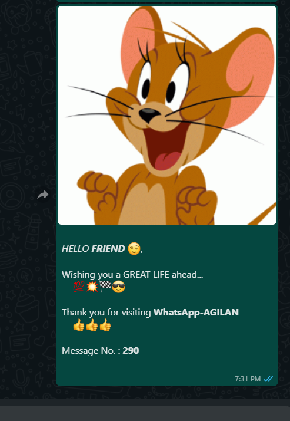

# CoolWhatsApp-API
An API hosted on **Heroku** platform that allows you to receive a greeting from me on **WhatsApp**

## url
FOR INDIA (+91)
> https://whatsapp-agilan.herokuapp.com/send?num=xxxxxxxxxx

FOR OTHERS 
> https://whatsapp-agilan.herokuapp.com/send?num=xxxxxxxxxx&cn=yy

Replace :
* **xxxxxxxxxx** with your **10 digit WhatsApp Number**
* **yy** with your **country-code**

Send a **GET** request to receive a greeting message

